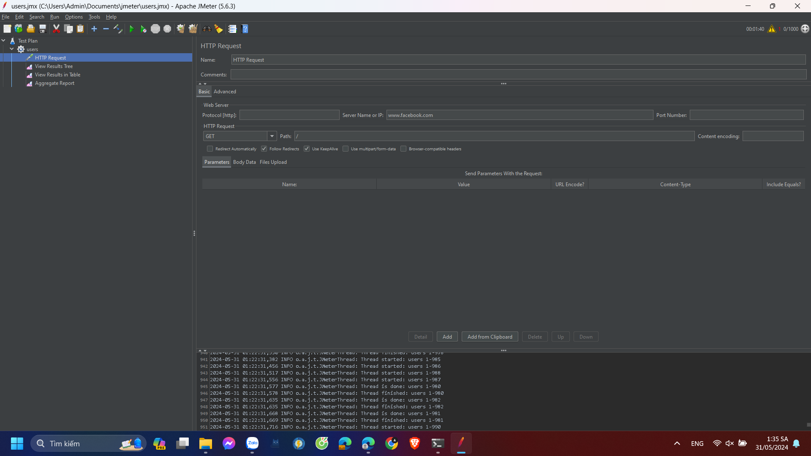

# Kiểm tra hiệu năng trang web

Sử dụng jMeter để tạo một kịch bản kiểm tra mô phỏng người dùng truy cập trang web https://facebook.com
Chạy kịch bản kiểm tra và ghi lại kết quả.
Phân tích kết quả kiểm tra, bao gồm thời gian phản hồi, số lượng yêu cầu thành công, số lượng yêu cầu thất bại, v.v.
Dựa trên kết quả phân tích, đưa ra kết luận về hiệu năng của trang web.

# Kịch bản kiểm tra

- Thread Group:
    + Số lượng thread: 1000
    + Thời gian chạy: 1 phút 40 giây
    + Ramp-up period: 10 giây
- HTTP Request:
    + URL: https://facebook.com/
    + Method: GET
    + Content encoding: UTF-8
- Listeners:
    + View Results Tree
    + View Results In Table
    + Aggregate Report

# Kết quả kiểm tra 

- Thread Group:

- HTTP Request:

- Listeners:

+ View Results Tree

+ View Results In Table

+ Aggregate Report

# Phân tích kết quả kiểm tra:
- Số lượng yêu cầu thành công: 999/1000 = 99,9%
- Số lượng yêu cầu thất bại: 1/1000 = 0,01%
- Thời gian phản hồi trung bình: 7,22 ms
- Thời gian phản hồi trung vị: 7,1 ms
- Chuyển tải: 10 yêu cầu/giây
# Kết luận:
    Trang web https://facebook.com/ có hiệu năng tốt. Số lượng yêu cầu thành công rất cao (99,9%), số lượng yêu cầu thất bại rất thấp (0,1%).